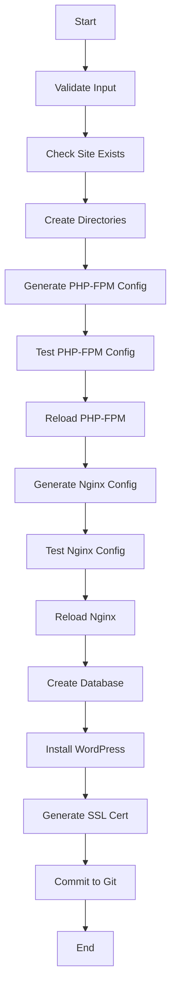

# wpzo-hosting Technical Design

## Design Philosophy

The wpzo-hosting infrastructure follows these core design principles:
- **Security by Design**: Every component isolated with minimal privileges
- **Automation First**: All operations scriptable and repeatable
- **Template-Driven**: Consistent configurations through templates
- **Fail-Safe**: Validation before changes, rollback capabilities
- **Observable**: Comprehensive logging and monitoring

## System Architecture

### Component Interaction Diagram
```
┌─────────────────┐    ┌─────────────────┐    ┌─────────────────┐
│   Cloudflare    │ -> │     Nginx       │ -> │    PHP-FPM      │
│     (CDN)       │    │  (Web Server)   │    │  (App Server)   │
└─────────────────┘    └─────────────────┘    └─────────────────┘
                              │                        │
                              v                        v
┌─────────────────┐    ┌─────────────────┐    ┌─────────────────┐
│   Let's Encrypt │    │   Static Files  │    │   MariaDB       │
│     (SSL)       │    │  (File System)  │    │  (Database)     │
└─────────────────┘    └─────────────────┘    └─────────────────┘
                              │
                              v
                       ┌─────────────────┐
                       │     AWS S3      │
                       │ (Static Deploy) │
                       └─────────────────┘
```

## Data Models

### Site Configuration Model
```bash
# Site Identifier
DOMAIN="example.com"           # Primary domain
SUB="www"                      # Subdomain
TECHNAME="examplecom_www"      # Technical name (alphanumeric)
DOMSHORT="exa"                 # Shortened domain (3 chars + 1 sub char)

# Paths
WEBROOT="/path/to/servers/${DOMAIN}/${SUB}/webroot"
CONF_DIR="/path/to/servers/${DOMAIN}/${SUB}/conf"
PHP_DIR="/path/to/servers/${DOMAIN}/${SUB}/php"
```

### Database Model
```sql
-- Per-site database structure
DATABASE: ${TECHNAME}_db
USER: ${TECHNAME}_user
PASSWORD: <generated-secure-password>
PRIVILEGES: ALL on ${TECHNAME}_db.*
```

### Configuration Template Variables
```bash
$DOMAIN          # Primary domain (example.com)
$SUB             # Subdomain (www)
$TECHNAME        # Technical name (examplecom_www)
$DOMSHORT        # Short domain (exaw)
$SERVERDIR       # Server base directory
$WORKDIR         # Working directory
```

## Security Design

### Process Isolation
```nginx
# Each site gets unique PHP-FPM pool
upstream php-${TECHNAME} {
    server unix:/run/php-fpm-${TECHNAME}.sock;
}
```

```ini
# PHP-FPM pool configuration per site
[${TECHNAME}]
user = nginx
group = nginx
listen = /run/php-fpm-${TECHNAME}.sock
listen.owner = nginx
listen.group = nginx
pm = dynamic
pm.max_children = 10
pm.start_servers = 2
pm.min_spare_servers = 1
pm.max_spare_servers = 3
```

### File System Security
```bash
# Directory permissions
chown -R nginx:nginx ${SERVERDIR}/${DOMAIN}/${SUB}/webroot/
chmod -R 755 ${SERVERDIR}/${DOMAIN}/${SUB}/webroot/
chmod -R 750 ${SERVERDIR}/${DOMAIN}/${SUB}/php/
```

### Nginx Security Headers
```nginx
# Security headers applied globally
add_header X-Frame-Options "SAMEORIGIN" always;
add_header X-Content-Type-Options "nosniff" always;
add_header X-XSS-Protection "1; mode=block" always;
add_header Referrer-Policy "strict-origin-when-cross-origin" always;
```

## Template System Design

### Template Processing Flow
```bash
# 1. Set environment variables
export DOMAIN SUB DOMSHORT TECHNAME

# 2. Process template with envsubst
envsubst "$(env | sed -e 's/=.*//' -e 's/^/\$/g')" < template.conf > output.conf

# 3. Validate configuration
nginx -t || php-fpm -t

# 4. Apply configuration
systemctl reload nginx php-fpm
```

### Template Structure
```
scripts/template/
├── nginx.conf      # Nginx virtual host template
├── phpfpm.conf     # PHP-FPM pool template  
├── wp-config.php   # WordPress configuration template
├── env.php         # Environment variables template
└── index.php       # Default index page template
```

## Service Management Design

### Configuration Validation Pipeline
```bash
# Validation workflow for each service
function validateAndReload() {
    local service=$1
    local config_test_cmd=$2
    local reload_cmd=$3
    
    # Test configuration
    if $config_test_cmd; then
        echo "Configuration valid"
        
        # Reload service
        if $reload_cmd; then
            echo "Service reloaded successfully"
        else
            echo "Service reload failed"
            exit 1
        fi
    else
        echo "Configuration invalid"
        exit 1
    fi
}
```

### Service Dependencies
```bash
# Service startup order
1. MariaDB (database)
2. PHP-FPM (application server)
3. Nginx (web server)
4. Certbot (SSL certificates)
```

## Database Design

### Database Provisioning Strategy
```sql
-- Database creation pattern
CREATE DATABASE IF NOT EXISTS `${TECHNAME}_db` 
  CHARACTER SET utf8mb4 
  COLLATE utf8mb4_unicode_520_ci;

-- User creation with strong password
CREATE USER IF NOT EXISTS '${TECHNAME}_user'@'localhost' 
  IDENTIFIED BY '${SECURE_PASSWORD}';

-- Grant minimal required privileges
GRANT ALL PRIVILEGES ON `${TECHNAME}_db`.* 
  TO '${TECHNAME}_user'@'localhost';

FLUSH PRIVILEGES;
```

### Connection Management
```php
// WordPress database configuration
define('DB_NAME', '${TECHNAME}_db');
define('DB_USER', '${TECHNAME}_user');
define('DB_PASSWORD', '${DB_PASSWORD}');
define('DB_HOST', 'YOUR_DB_SERVER_IP');
define('DB_CHARSET', 'utf8mb4');
define('DB_COLLATE', 'utf8mb4_unicode_520_ci');
```

## Monitoring and Logging Design

### Log Structure
```
/var/log/
├── nginx/
│   ├── access.log          # Global access log
│   ├── error.log           # Global error log
│   └── ${TECHNAME}_*       # Per-site logs
├── php-fpm/
│   ├── error.log           # Global PHP-FPM log
│   └── ${TECHNAME}_*       # Per-site PHP logs
└── wordpress/
    └── ${TECHNAME}_*       # Per-site WordPress logs
```

### Error Handling Strategy
```bash
# Error handling in scripts
set -euo pipefail  # Exit on error, undefined vars, pipe failures

function handleError() {
    local exit_code=$?
    local line_number=$1
    echo "Error on line $line_number: Command exited with status $exit_code"
    # Cleanup operations
    exit $exit_code
}

trap 'handleError $LINENO' ERR
```

## Deployment Design

### Site Creation Flow


### Configuration Deployment
```bash
# Atomic configuration deployment
function deployConfig() {
    local temp_config=$(mktemp)
    local target_config=$1
    local template=$2
    
    # Generate configuration
    envsubst < "$template" > "$temp_config"
    
    # Validate configuration
    if validateConfig "$temp_config"; then
        # Atomic move
        mv "$temp_config" "$target_config"
        return 0
    else
        rm "$temp_config"
        return 1
    fi
}
```

## Performance Design

### Resource Allocation Strategy
```ini
# PHP-FPM pool sizing based on site traffic
# Low traffic sites
pm.max_children = 5
pm.start_servers = 1
pm.min_spare_servers = 1
pm.max_spare_servers = 2

# High traffic sites  
pm.max_children = 20
pm.start_servers = 5
pm.min_spare_servers = 3
pm.max_spare_servers = 8
```

### Caching Architecture
```nginx
# Nginx caching configuration
location ~* \.(css|js|png|jpg|jpeg|gif|ico|svg)$ {
    expires 1y;
    add_header Cache-Control "public, immutable";
    access_log off;
}

# WordPress-specific caching
location / {
    try_files $uri $uri/ /index.php?$args;
    
    # Cache static content
    location ~* \.(css|js|png|jpg|jpeg|gif|ico|svg|woff|woff2|ttf|eot)$ {
        expires 1y;
        add_header Cache-Control "public, immutable";
        access_log off;
    }
}
```

## Backup and Recovery Design

### Configuration Backup Strategy
```bash
# Git-based configuration backup
function backupConfig() {
    local change_description="$1"
    
    # Add all configuration files
    git add nginx/sites-available/ nginx/sites-enabled/ php-fpm.d/
    
    # Commit with descriptive message
    git commit -m "[config] $change_description"
    
    # Push to remote repository
    git push origin master
}
```

### Data Backup Considerations
```bash
# Database backup template
mysqldump \
    --single-transaction \
    --routines \
    --triggers \
    --databases "${TECHNAME}_db" \
    > "${BACKUP_DIR}/${TECHNAME}_$(date +%Y%m%d_%H%M%S).sql"
```

## Integration Points

### Cloudflare Integration
```nginx
# Real IP restoration
set_real_ip_from 103.21.244.0/22;
set_real_ip_from 103.22.200.0/22;
# ... (additional Cloudflare IP ranges)
real_ip_header CF-Connecting-IP;
```

### AWS S3 Integration  
```bash
# Static site deployment
aws s3 sync \
    --quiet \
    --delete \
    "${SERVERDIR}/${DOMAIN}/${SUB}/static" \
    "s3://${DOMAIN_FULL}" \
    --exclude "*.git/*" \
    --exclude "wp-admin/*" \
    --exclude "wp-json/*"
```

This design ensures scalable, secure, and maintainable WordPress hosting infrastructure with clear separation of concerns and robust operational procedures.